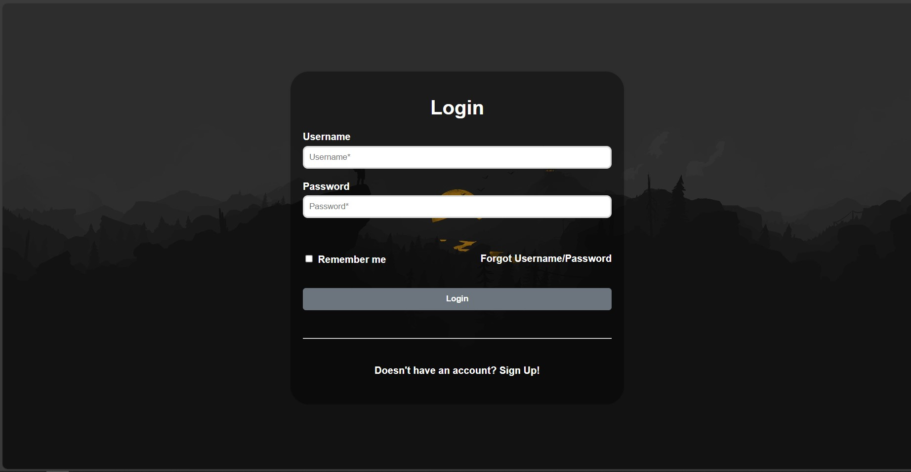
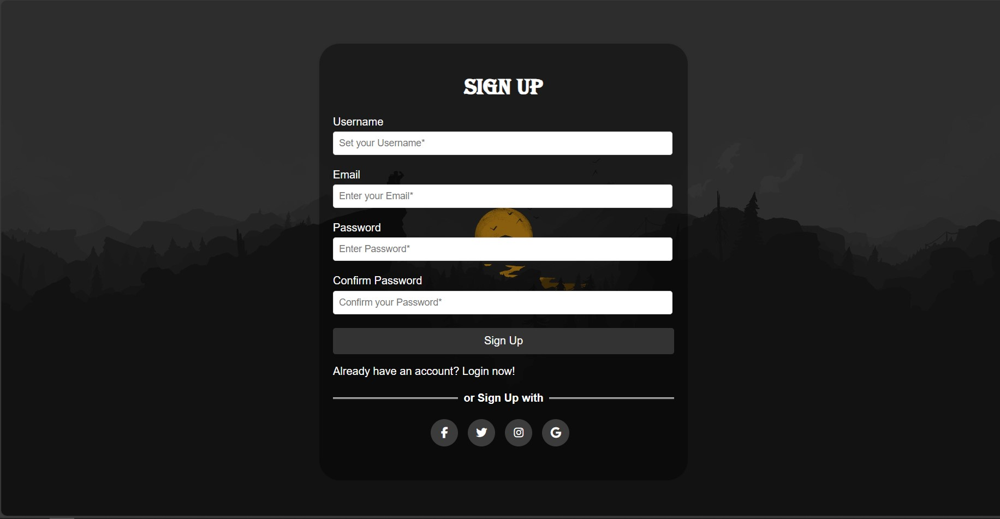

# Login and Signup Pages

This project contains a simple login and signup pages built using HTML and CSS. These pages provide a basic authentication system for users to sign in or register for an account.

## Features

- **Login Page:** Users can enter their username and password to log into their account.
- **Signup Page:** New users can register for an account by providing their username, email, and password.
- **Responsive Design:** The pages are designed to be responsive, ensuring a consistent user experience across different devices and screen sizes.

## Screenshots

## Usage

To use the login and signup pages:

1. Clone this repository to your local machine.
2. Open the `login.html` file in your web browser to access the login page.
3. Click on the "Sign Up" link to navigate to the signup page.
4. Fill out the required fields and click the "Sign Up" button to register for an account.
5. Once registered, return to the login page and enter your credentials to log in.
